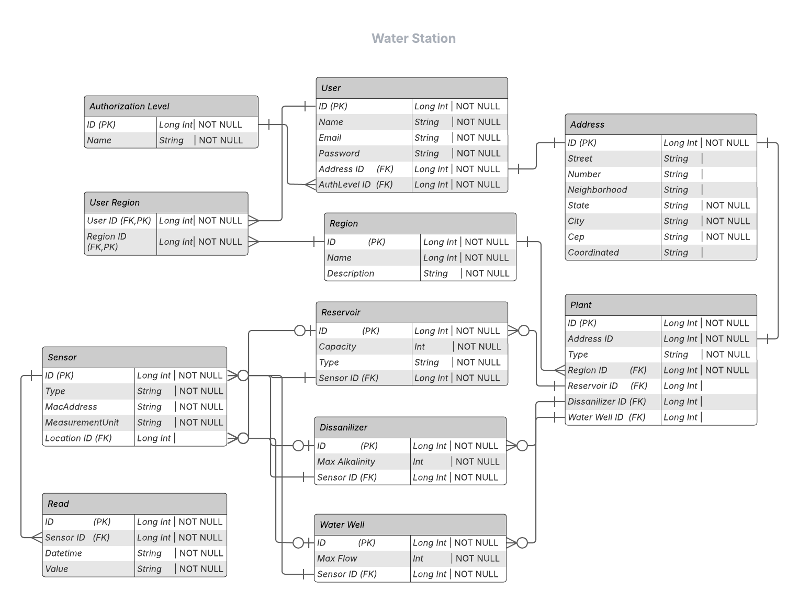

# Water Station Management System

## Overview

Water Station é um sistema de gerenciamento completo para monitoramento de estações de extração e distribuição de água, desenvolvido com Django e arquitetura MVC. O sistema permite o controle e monitoramento em tempo real de reservatórios, dessalinizadores e poços de água, utilizando sensores IoT para coleta de dados.

## Funcionalidades

### Gerenciamento de Usuários e Permissões
- Sistema de autenticação e autorização
- Níveis de permissão personalizáveis
- Perfis de usuário com informações de contato e endereço

### Cenários e Plantas
- Criação e gerenciamento de múltiplos cenários de operação
- Configuração de plantas com localização geográfica
- Compartilhamento de cenários entre usuários

### Componentes Hídricos
- Gerenciamento de reservatórios com tipo e capacidade
- Monitoramento de dessalinizadores com controle de alcalinidade
- Rastreamento de poços de água com medição de fluxo

### Sensores e Leituras
- Suporte a múltiplos tipos de sensores (temperatura, pressão, pH, fluxo)
- Rastreamento em tempo real de leituras
- Histórico de medições com timestamp

### Dashboard e Análises
- Painel de controle com visão geral do sistema
- Gráficos e visualizações de dados
- Relatórios personalizáveis

### API RESTful
- API completa para integração com outros sistemas
- Documentação de endpoints
- Autenticação segura

## Tecnologias

- **Backend**: Django 5.0+
- **Frontend**: HTML, CSS, JavaScript, Bootstrap 5
- **Banco de Dados**: PostgreSQL (recomendado), SQLite (desenvolvimento), MariaDB (prévia)
- **Autenticação**: Django Authentication System
- **API**: Django REST Framework

## Cardinalidades

- **Users → Address (1:N)**
  - Address.UserID → Users(ID) com `ON DELETE CASCADE` garante que cada usuário possa ter 0…N endereços, e cada endereço pertence a exatamente um usuário.
- **Users → AuthorizationLevel (N:1)**
  - Users.AuthLevelID → AuthorizationLevel(ID) modela muitos usuários para um mesmo nível de autorização.
- **Users ↔ Region (N:M)**
  - Tabela UserRegion(UserID,RegionID) com FKs para Users e Region satisfaz o relacionamento many-to-many.
- **Plant → Region (N:1)**
  - Plant.RegionID → Region(ID) atende a muitas estações numa mesma região.
- **Plant → Reservoir/Dissanilizer/WaterWell (1:N)**
  - Cada uma das tabelas Reservoir, Dissanilizer e WaterWell possui PlantID → Plant(ID) com `ON DELETE CASCADE`.
- **Reservoir/Dissanilizer/WaterWell → Sensor (1:N) e Sensor → Read (1:N)**
  - O modelo polimórfico via ComponentType + SensorComponent(ComponentID) permite associar cada sensor a exatamente um componente (reservatório, dessalinizador ou poço) e cada um desses componentes poder ter 0…N sensores.
  - SensorRead.SensorID → Sensor(ID) atende ao 1:N de leituras por sensor.

## Requisitos

- Python 3.10+
- Django 5.0+
- PostgreSQL ou SQLite
- Outras dependências listadas em `requirements.txt`

## Contribuição

1. Faça um fork do projeto
2. Crie uma branch para sua feature (`git checkout -b feature/nova-funcionalidade`)
3. Commit suas mudanças (`git commit -am 'Adiciona nova funcionalidade'`)
4. Push para a branch (`git push origin feature/nova-funcionalidade`)
5. Abra um Pull Request para branch develop

## Licença

Este projeto está licenciado sob a [MIT License](LICENSE).
